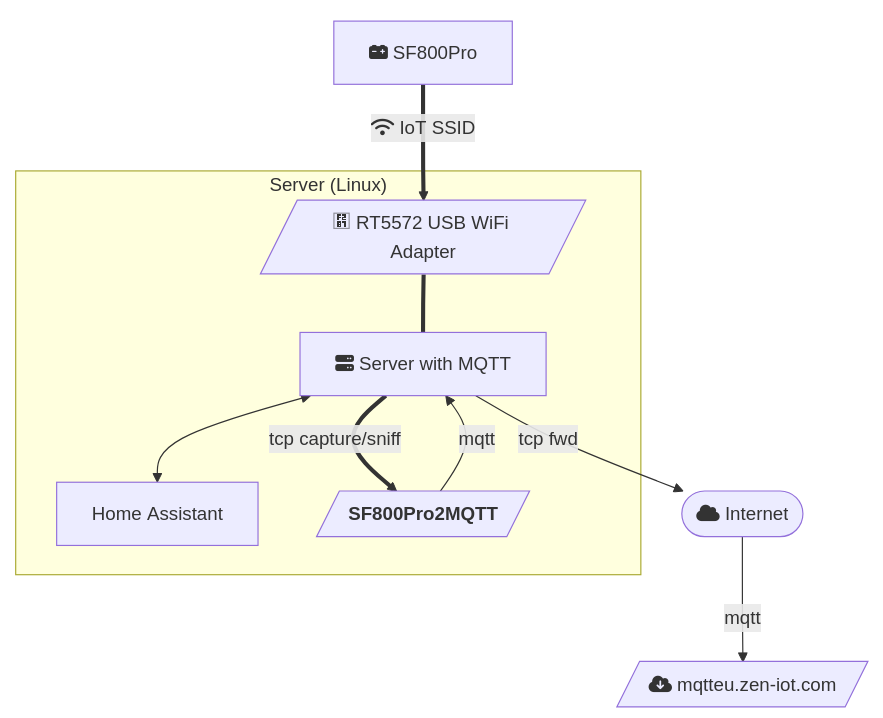

# SolarFlow 800 Pro to Mqtt (via network traffic sniffing)

Capture TCP traffic from a SolarFlow 800 Pro solar battery and
extract information for publishing to an own (local) MQTT broker.

The tool is intended for quick, non-intrusive integrations of the “cloud only” /
"app only" IoT device, here the solar battery *SolarFlow 800 Pro*.

## Motivation

This integration tool is rooted in the desire for resilience, security, user autonomy, cost-effectiveness, scalability, and sustainability. By enabling local, air-gapped applications, users can leverage IoT technologies while minimizing risks and maximizing control over their systems.

- *Air-Gapped*: The tool allows for the integration of IoT devices without relying on cloud services, which can be vulnerable to outages, data breaches, or service disruptions. By operating in an air-gapped environment, users can ensure that their systems remain functional even without internet connectivity.
- *Local Control*: maintain control over your own devices locally, reducing the risk associated with external dependencies.
- *Minimized Data Exposure*: sensitive data generated by the IoT devices can be kept within the local network. This helps protect against unauthorized access and potential data leaks.
- *Enhanced Security*: implement tailored security measures, reduce the attack surface.
- *Adaptability / No Lock-In*: not tied to specific cloud providers this can facilitate accommodation of emerging technologies and protocols,  without being locked into a specific ecosystem.
- *Customizable Integrations*: facilitate quick integration in other home applicances, e.g., Home Assistant.
- *Lower Operational Costs*: save on subscription fees and data transfer costs.
- *Efficient Resource Utilization*:better utilization of existing infrastructure, reducing the need for additional cloud resources.
- *Reduced Energy Consumption*: no resource and energy hungry cloud infrastructure, no data transmission to and from cloud services.


## My Setup




---

## Features

| Feature | Description |
|---------|-------------|
| Live packet sniffing | Uses Scapy with a BPF filter (`tcp and host …`). |
| Zero parsing configs | Topic + payload are detected by RegEx. |
| MQTT forwarding | Publishes to any broker (TLS/Auth optional). |
| Minimal dependencies | `scapy` and `paho-mqtt`. |
| Runs on Linux & Raspberry Pi | Root privileges only required for sniffing. |


## Prerequisites

* Python ≥ 3.11
* Poetry 2.x
* Linux with `libpcap` (already present on most systems)
* Root/sudo rights to capture on the interface
* An MQTT broker you can publish to


## How-To Run

1. `poetry sync --only=main`
2. `cp env.template .env`, then adjust values to your setup
3. Make sure all servers are set up and ready, e.g. MQTT.
4. `sudo poetry run python sf800psniff2mqtt.py`

For permanent installation have a look at `systemd/`.


## Example Output / Messages

| Topic | Payload (trimmed) |
|-------|-------------------|
| `/R3mn8U/deviceId/function/invoke` | `{"messageId":669682,"function":"hemsEP","arguments":{"outputPower":0,"chargePower":125, ...}}` |
| `/R3mn8U/deviceId/function/invoke/reply` | `{"messageId":669682,"mode":9,"chargeMode":3,"timestamp":1751115741,"success":true}` |
| `/R3mn8U/deviceId/properties/energy` | `{"messageId":13747,"timestamp":1751115744,"properties":{"gridOffPower":0,"chargePower":0, ...}}` |


## Solar Flow 800 Pro MQTT Values


| **Field Name**                     | **Field Description (presumably)**                                   |
|------------------------------------|-----------------------------------------------------------------------|
| energy                             | |
| energy.deviceId                    | Unique ID of the solar battery device.                                |
| energy.messageId                   | Sequential message identifier.                                        |
| energy.product                     | Device model name.                                                    |
| energy.timestamp                   | Epoch timestamp when data was recorded.                               |
| energy.version                     | Message format version (in 07/2025 it is '2').                         |
| energy.properties.gridOffPower     | Power in off-grid mode (watts).                                       |
| energy.properties.chargePower      | ... |
| energy.properties.outputPower      | ... |
| energy.properties.mode             | ... |
| energy.properties.chargeMode       | ... |
| energy.properties.LCNState         | Local control network state.                                          |
| report                             | |
| report.deviceId                    | Unique ID of the solar battery device.                                |
| report.messageId                   | Sequential message identifier.                                        |
| report.product                     | Device model name.                                                    |
| report.timestamp                   | Epoch timestamp when data was recorded.                               |
| report.version                     | Message format version (in 07/2025 it is '2').                         |
| report.packData[]                  | List of battery pack metrics (can contain multiple entries).          |
| report.packData[].batcur           | Battery current (unit likely deci-amps, raw value may need scaling).  |
| report.packData[].maxTemp          | Battery pack temperature; Celsius = (value / 10) - 273.15             |
| report.packData[].maxVol           | Maximum cell voltage (unit tenths of volt).                           |
| report.packData[].minVol           | Minimum cell voltage (unit tenths of volt).                           |
| report.packData[].packType         | Encoded type or configuration of the battery pack.                    |
| report.packData[].power            | Power value (watts).                                                  |
| report.packData[].sn               | Serial number of the battery pack.                                    |
| report.packData[].socLevel         | State of charge (percentage).                                         |
| report.packData[].softVersion      | Firmware (software) version (e.g., 4117).                             |
| report.packData[].state            | Operational state code (0=idle, 1=charging, 2=discharing).            |
| report.packData[].totalVol         | Total voltage of the battery pack                                     |
| report.properties                  | Real-time operational properties of the system.                       |
| report.properties.BatVolt          | Current battery voltage.                                              |
| report.properties.Fanmode          | Fan control mode (0=auto?, 1=manual?).                                |
| report.properties.Fanspeed         | Current fan speed setting.                                            |
| report.properties.IOTState         | IoT connectivity state (2=WiFi+Cloud connected).                      |
| report.properties.LCNState         | Local control network state.                                          |
| report.properties.OTAState         | Over-the-air update status.                                           |
| report.properties.VoltWakeup       | Voltage threshold for system wake-up.                                 |
| report.properties.acMode           | AC mode (2=on-grid).                                                  |
| report.properties.acStatus         | AC output status (0=off, 1=on).                                       |
| report.properties.aiState          | AI feature status (0=off, 1=on).                                      |
| report.properties.bindstate        | Binding status with app/cloud.                                        |
| report.properties.chargeMaxLimit   | Max charge power limit (watts).                                       |
| report.properties.dataReady        | Flag indicating new data is available.                                |
| report.properties.dcStatus         | DC output/input state.                                                |
| report.properties.electricLevel    | Battery level (%).                                                    |
| report.properties.factoryModeState | Factory/test mode active (0=no, 1=yes).                               |
| report.properties.gridInputPower   | Grid power being drawn (watts).                                       |
| report.properties.gridOffMode      | Off-grid operation mode (0=off, 1=on).                                |
| report.properties.gridOffPower     | Power in off-grid mode (watts).                                       |
| report.properties.gridReverse      | Grid reverse mode.                                                    |
| report.properties.gridStandard     | Regional grid standard.                                               |
| report.properties.gridState        | Grid connection status (0=not connected, 1=connected).                |
| report.properties.heatState        | Heating system active (0=off, 1=on).                                  |
| report.properties.hyperTmp         | HUB temperature sensor; Celsius = (value / 10) - 273.15               |
| report.properties.inputLimit       | Max allowed input power (watts), typically dynamic.                   |
| report.properties.inverseMaxPower  | Inverter max output power (watts), typically 800.                     |
| report.properties.lampSwitch       | LED indicator state (0=off, 1=on).                                    |
| report.properties.minSoc           | Lower SoC target (unit tenths of %), typically 100=10%.               |
| report.properties.oldMode          | Legacy mode active (if any).                                          |
| report.properties.outputHomePower  | Power currently supplied (watts), i.e., battery power delivery.       |
| report.properties.outputLimit      | Max power allowed to output (watts), typically dynamic.               |
| report.properties.outputPackPower  | Power charging into the battery pack.                                 |
| report.properties.packInputPower   | Power being discharged from pack.                                     |
| report.properties.packState        | Operational state of battery pack (0=idle, 1=charging, 2=discharing). |
| report.properties.pass             | Bypass mode (0=automatic, 1=always off, 2=always on).                 |
| report.properties.pvStatus         | Photovoltaic input status (0=on, 1=off).                              |
| report.properties.remainOutTime    | Time remaining with current SoC.                                      |
| report.properties.reverseState     | Grid feed-in state.                                                   |
| report.properties.rssi             | WiFi signal strength (in dBm).                                        |
| report.properties.smartMode        | Smart mode active (0/1).                                              |
| report.properties.socSet           | Target state of charge (e.g., 1000 = 100%).                           |
| report.properties.socStatus        | Current SoC control state.                                            |
| report.properties.solarInputPower  | Total solar input power.                                              |
| report.properties.solarPower1–4    | Power from individual solar channels.                                 |
| report.properties.ts               | Timestamp of this property snapshot (epoch).                          |
| report.properties.tsZone           | Time zone (an ID?; Europe/Berlin is '14').                            |
| report.properties.writeRsp         | Response code for last write/config command.                          |


## Home Assistant

`configuration.yml`:

```yaml
mqtt:
  # https://www.home-assistant.io/integrations/sensor.mqtt/
  # https://www.home-assistant.io/integrations/sensor#device-class
  # https://developers.home-assistant.io/docs/core/entity/sensor/#available-state-classes
  - sensor:
   - name: "SolarFlow 800 Pro OutputHomePower"
      state_topic: "tele/R3mn8U/deviceId/properties/report"
      value_template: "{{ value_json.properties.outputHomePower }}"
      unique_id: "solarflow800pro1-outputHomePower"
      # energy dashboard: device_class must be energy, state_class must be total / total_increasing
      # https://www.home-assistant.io/docs/energy/faq/#troubleshooting-missing-entities
      device_class: "energy"     # must be "energy" to work with energy dashboard!
      unit_of_measurement: "Wh"  # device-class "energy" => "Wh"!
      state_class: "total"       # must be "total" to work with energy dashboard
    - name: "SolarFlow 800 Pro GridInputPower"
      state_topic: "tele/R3mn8U/deviceId/properties/report"
      value_template: "{{ value_json.properties.gridInputPower }}"
      unique_id: "solarflow800pro1-gridinputpower"
      # energy dashboard: device_class must be energy, state_class must be total / total_increasing
      # https://www.home-assistant.io/docs/energy/faq/#troubleshooting-missing-entities
      device_class: "energy"     # must be "energy" to work with energy dashboard!
      unit_of_measurement: "Wh"  # device-class "energy" => "Wh"!
      state_class: "total"       # must be "total" to work with energy dashboard
    - name: "SolarFlow 800 Pro PV Input"
      state_topic: "tele/R3mn8U/deviceId/properties/report"
      value_template: "{{ value_json.properties.solarInputPower }}"
      unique_id: "solarflow800pro1-pvinput"
      # energy dashboard: device_class must be energy, state_class must be total / total_increasing
      # https://www.home-assistant.io/docs/energy/faq/#troubleshooting-missing-entities
      device_class: "energy"     # must be "energy" to work with energy dashboard!
      unit_of_measurement: "Wh"  # device-class "energy" => "Wh"!
      state_class: "total"       # must be "total" to work with energy dashboard
    # duplicate solarInputPower but with different device_class & unit & state_class
    - name: "SolarFlow 800 Pro PV Input Watt"
      state_topic: "tele/R3mn8U/deviceId/properties/report"
      value_template: "{{ value_json.properties.solarInputPower }}"
      unique_id: "solarflow800pro1-pvinput-watt"
      device_class: "power"
      unit_of_measurement: "W"
      state_class: "measurement"
    - name: "SolarFlow 800 Pro OutputPackPower"
      state_topic: "tele/R3mn8U/deviceId/properties/report"
      value_template: "{{ value_json.properties.outputPackPower }}"
      unique_id: "solarflow800pro1-outputpackpower"
      device_class: "energy"     # must be "energy" to work with energy dashboard!
      unit_of_measurement: "Wh"  # device-class "energy" => "Wh"!
      state_class: "total"       # must be "total" to work with energy dashboard
    - name: "SolarFlow 800 Pro PackInputPower"
      state_topic: "tele/R3mn8U/deviceId/properties/report"
      value_template: "{{ value_json.properties.packInputPower }}"
      unique_id: "solarflow800pro1-packinputpower"
      device_class: "energy"     # must be "energy" to work with energy dashboard!
      unit_of_measurement: "Wh"  # device-class "energy" => "Wh"!
      state_class: "total"       # must be "total" to work with energy dashboard
    - name: "SolarFlow 800 Pro ElectricLevel"
      state_topic: "tele/R3mn8U/deviceId/properties/report"
      value_template: "{{ value_json.properties.electricLevel }}"
      unique_id: "solarflow800pro1-electriclevel"
      device_class: "battery"
      unit_of_measurement: "%"
      state_class: "measurement"
    - name: "SolarFlow 800 Pro Hub Temperature"
      state_topic: "tele/R3mn8U/deviceId/properties/report"
      value_template: "{{ (value_json.properties.hyperTmp / 10) - 273.15 | round(1) }}"
      unique_id: "solarflow800pro1-hypertmp"
      device_class: "temperature"
      unit_of_measurement: "°C"
      state_class: "measurement"
    - name: "SolarFlow 800 Pro Battery1 Temperature"
      state_topic: "tele/R3mn8U/deviceId/properties/report"
      value_template: "{{ (value_json.packData[0].maxTemp / 10) - 273.15 | round(1) }}"
      unique_id: "solarflow800pro1-packdata0-maxtemp"
      device_class: "temperature"
      unit_of_measurement: "°C"
      state_class: "measurement"
```
