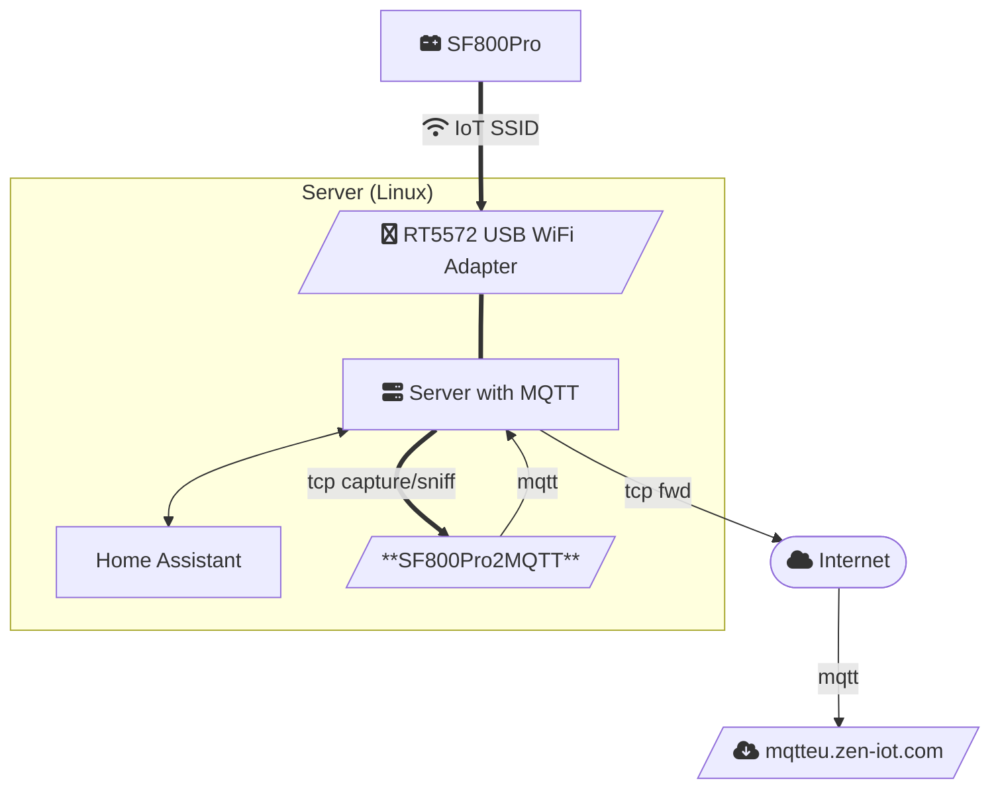

# SolarFlow 800 Pro to Mqtt (via network traffic sniffing)

Capture TCP traffic from a SolarFlow 800 Pro solar battery and 
extract information for publishing to an own (local) MQTT broker.

The tool is intended for quick, non-intrusive integrations of the “cloud only” / 
"app only" IoT device, here the solar battery *SolarFlow 800 Pro*.

## Motivation

This integration tool is rooted in the desire for resilience, security, user autonomy, cost-effectiveness, scalability, and sustainability. By enabling local, air-gapped applications, users can leverage IoT technologies while minimizing risks and maximizing control over their systems.

- *Air-Gapped*: The tool allows for the integration of IoT devices without relying on cloud services, which can be vulnerable to outages, data breaches, or service disruptions. By operating in an air-gapped environment, users can ensure that their systems remain functional even without internet connectivity.
- *Local Control*: maintain control over your own devices locally, reducing the risk associated with external dependencies.
- *Minimized Data Exposure*: sensitive data generated by the IoT devices can be kept within the local network. This helps protect against unauthorized access and potential data leaks.
- *Enhanced Security*: implement tailored security measures, reduce the attack surface.
- *Adaptability / No Lock-In*: not tied to specific cloud providers this can facilitate accommodation of emerging technologies and protocols,  without being locked into a specific ecosystem.
- *Customizable Integrations*: facilitate quick integration in other home applicances, e.g., Home Assistant.
- *Lower Operational Costs*: save on subscription fees and data transfer costs.
- *Efficient Resource Utilization*:better utilization of existing infrastructure, reducing the need for additional cloud resources.
- *Reduced Energy Consumption*: no resource and energy hungry cloud infrastructure, no data transmission to and from cloud services.

## My Setup

---

## Features

| Feature | Description |
|---------|-------------|
| Live packet sniffing | Uses Scapy with a BPF filter (`tcp and host …`). |
| Zero parsing configs | Topic + payload are detected by RegEx. |
| MQTT forwarding | Publishes to any broker (TLS/Auth optional). |
| Minimal dependencies | `scapy` and `paho-mqtt`. |
| Runs on Linux & Raspberry Pi | Root privileges only required for sniffing. |

## Prerequisites

* Python ≥ 3.11
* Poetry 2.x
* Linux with `libpcap` (already present on most systems)
* Root/sudo rights to capture on the interface
* An MQTT broker you can publish to

## How-To Run

1. `poetry sync --only=main`
2. `cp env.template .env`, then adjust values to your setup
3. Make sure all servers are set up and ready, e.g. MQTT.
4. `sudo poetry run python sf800psniff2mqtt.py`

For permanent installation have a look at `systemd/`.

## Example Output / Messages

| Topic | Payload (trimmed) |
|-------|-------------------|
| `/R3mn8U/deviceId/function/invoke` | `{"messageId":669682,"function":"hemsEP","arguments":{"outputPower":0,"chargePower":125, ...}}` |
| `/R3mn8U/deviceId/function/invoke/reply` | `{"messageId":669682,"mode":9,"chargeMode":3,"timestamp":1751115741,"success":true}` |
| `/R3mn8U/deviceId/properties/energy` | `{"messageId":13747,"timestamp":1751115744,"properties":{"gridOffPower":0,"chargePower":0, ...}}` |
